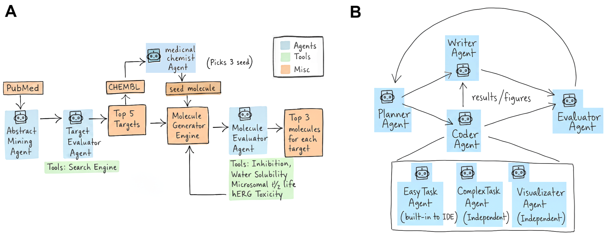
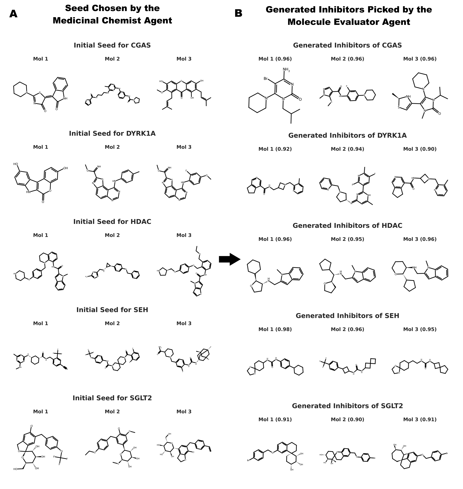

# Multi-target Parallel Drug Discovery with Multi-agent Orchestration

This repository contains the source code and data for a agentic pipeline designed to identify novel therapeutic targets and generate promising lead compounds for Alzheimer's disease.



---

### Key Features

- **Automated Target Identification**: Leverages Large Language Models (Gemini) to parse PubMed abstracts for novel, druggable protein targets implicated in Alzheimer's disease.
- **Validated Predictive Models**: Implements XGBoost models to predict bioactivity against identified targets and key ADMET (Absorption, Distribution, Metabolism, Excretion, and Toxicity) properties. Models are rigorously validated using scaffold-based splits.
- **Generative Molecule Design**: Utilizes NVIDIA's MolMIM generative model to design novel molecules with desired properties, based on structurally diverse seed compounds.
- **Reproducible Workflow**: The entire pipeline is encapsulated in three sequential Jupyter notebooks, ensuring full reproducibility of the results.

---

### Methodology

The agentic workflow consists of three primary stages:

1.  **Target Mining (`0_target_mining_...ipynb`)**: This notebook performs a systematic search of the PubMed database to identify and validate potential drug targets based on recent scientific literature.
2.  **Model Training (`1_ml_training_...ipynb`)**: This notebook trains and validates predictive models for the identified targets using data from ChEMBL, and for key ADMET properties using data from Therapeutics Data Commons (TDC).
3.  **Molecule Generation and Evaluation (`2_molecule_evaluation_...ipynb`)**: This notebook selects diverse seed compounds from known actives, generates novel analogs using a generative model, and evaluates them using the suite of trained predictive models.

---

### Installation

The project requires Python and several scientific computing libraries. Dependencies can be installed via pip:

```bash
pip install -r requirements.txt
```

---

### Results

The pipeline demonstrates the successful identification of high-potential targets and the generation of novel molecules with predicted high target affinity and favorable ADMET profiles.

**Generated Molecules for Top Targets:**


---

### Contributions

Feedback, bug reports, and contributions are welcome. Please open an issue or submit a pull request if you have suggestions for improving this work.
